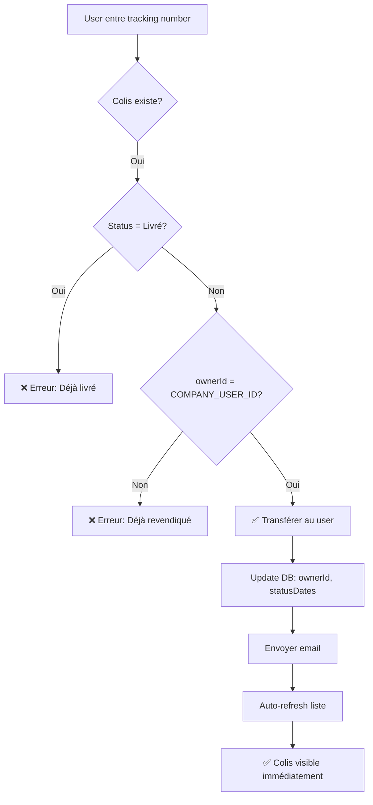
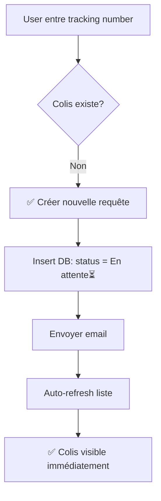

# 📦 Changements Coordonnés - Web App & Mobile App

## 🎯 Fonctionnalité Ajoutée : Soumission de Requête de Colis Mobile

Date : 2025-10-18

---

## 📱 Application Mobile - Nouveaux Fichiers

### 1. **Nouveau Screen**
- `pniceshipping-mobile/src/screens/AddShipmentScreen.tsx` (579 lignes)
  - Formulaire de soumission de requête de colis
  - Logique de transfert identique au web
  - Validation de sécurité complète
  - Interface moderne avec animations

### 2. **Nouveau Navigateur**
- `pniceshipping-mobile/src/navigation/RootNavigator.tsx` (32 lignes)
  - Stack Navigator pour gérer les modales
  - Types TypeScript pour la navigation

### 3. **Documentation**
- `pniceshipping-mobile/MOBILE_SHIPMENT_FEATURE.md` (430 lignes)
  - Documentation complète de la fonctionnalité
  - Guide de tests
  - Instructions d'installation

---

## 📱 Application Mobile - Fichiers Modifiés

### 1. **ShipmentsScreen.tsx**
**Changements :**
- ✅ Import de `useNavigation` de React Navigation
- ✅ Ajout de la fonction `handleAddShipment()` pour navigation
- ✅ Ajout d'un bouton FAB (Floating Action Button) en bas à droite
- ✅ Ajout d'un bouton dans l'empty state pour nouveaux utilisateurs
- ✅ Styles pour FAB et bouton empty state

**Lignes modifiées :** ~50 lignes ajoutées

---

### 2. **App.tsx**
**Changements :**
- ✅ Import de `RootNavigator` au lieu de `TabNavigator`
- ✅ Renommage de `RootNavigator` → `AuthNavigator` (pour éviter confusion)
- ✅ Utilisation de `RootNavigator` dans le `NavigationContainer`

**Lignes modifiées :** 3 lignes

---

### 3. **package.json**
**Changements :**
- ✅ Ajout de `@react-navigation/native-stack": "^7.4.3"`

**Installation requise :**
```bash
cd pniceshipping-mobile
npm install @react-navigation/native-stack@^7.4.3
```

---

## 🌐 Application Web - Aucun Changement

L'application web (`AddShipmentByUser.tsx`) était déjà implémentée avec toute la logique nécessaire. L'app mobile **reproduit exactement la même logique**.

---

## 🔄 Logique Partagée

### Constantes Communes

```typescript
COMPANY_USER_ID = "user_2v0TyYr3oFSH1ZqHhlas0sPkEyq"
```

Cette constante est utilisée dans les deux applications pour identifier les colis appartenant à la compagnie qui peuvent être transférés.

---

### Destinations Partagées

**Web** : `src/assets/shared/shipmentDetails.json`
**Mobile** : Hardcodé dans `AddShipmentScreen.tsx`

```typescript
const DESTINATIONS = [
  'Cap-haitien, Rue 6 j-k',
  'Cap-Haitien, Vertiere Village Christophe',
  'Port-Au-Prince (Local Le Grand Nord) Delmas 33 a coté parc midoré',
];
```

---

### Statuts Partagés

| Statut | Emoji | Utilisation |
|--------|-------|-------------|
| En attente | ⏳ | Colis créé mais pas encore reçu |
| Recu | 📦 | Colis reçu dans les locaux |
| En Transit | ✈️ | Colis en route vers destination |
| Disponible | 🟢 | Colis prêt pour récupération |
| Livré | ✅ | Colis livré au client |

---

### Service Email Partagé

**Endpoint :** `https://pnice-shipping-emails.onrender.com/send-email`

**Utilisé par :**
- ✅ Web App (`src/services/emailServices.ts`)
- ✅ Mobile App (`src/screens/AddShipmentScreen.tsx`)

**Body :**
```json
{
  "userName": "John Doe",
  "userEmail": "john@example.com",
  "packageId": "TRK123456",
  "status": "En attente⏳",
  "message": "Votre colis a été transféré..."
}
```

---

## 🗄️ Base de Données Partagée

Les deux applications utilisent la **même base de données PostgreSQL (Neon)** via Drizzle ORM.

### Table : `shipmentListing`

**Colonnes importantes pour cette fonctionnalité :**
```typescript
{
  id: serial,
  ownerId: varchar,           // Clerk user ID
  trackingNumber: varchar,    // Unique identifier
  status: varchar,            // "En attente⏳", "Recu📦", etc.
  statusDates: json,          // Array of status history
  destination: varchar,
  // ... autres colonnes
}
```

---

## 🔒 Validation de Sécurité

### Règles Identiques Web & Mobile

#### 1. **Transfert de Colis Existant**

**Conditions de validation :**

```typescript
// ❌ Refus si colis déjà livré
if (shipment.status === 'Livré✅') {
  return ERROR_DELIVERED;
}

// ❌ Refus si déjà revendiqué par un autre client
if (shipment.ownerId !== COMPANY_USER_ID) {
  return ERROR_CLAIMED;
}

// ✅ Transfert autorisé
if (shipment.ownerId === COMPANY_USER_ID) {
  transferToUser(shipment, user);
}
```

#### 2. **Nouvelle Requête**

```typescript
// ✅ Création autorisée si tracking number n'existe pas
if (!shipmentExists) {
  createNewShipmentRequest(trackingNumber, user);
}
```

---

## 📊 Flux de Données

### Scénario 1 : Transfert de Colis Existant



### Scénario 2 : Nouvelle Requête



---

## 🎨 Comparaison des Interfaces

### Web App
- **Framework** : React + Vite
- **Styling** : Tailwind CSS
- **Animations** : Framer Motion
- **Navigation** : React Router

### Mobile App
- **Framework** : React Native + Expo
- **Styling** : StyleSheet (React Native)
- **Animations** : React Native Reanimated
- **Navigation** : React Navigation (Stack + Tabs)

### Design Cohérent

Les deux applications partagent :
- ✅ Même palette de couleurs (bleu, vert, rouge, orange)
- ✅ Même iconographie (Ionicons)
- ✅ Même terminologie française
- ✅ Même structure de messages d'erreur/succès

---

## 🚀 Fonctionnalité d'Auto-Refresh

### Web App
Utilise un callback `setRefreshShipments(true)` passé en props.

### Mobile App
Utilise un callback `onShipmentAdded()` passé via navigation params :

```typescript
// Navigation avec callback
navigation.navigate('AddShipment', {
  onShipmentAdded: () => {
    loadShipments(); // Recharge la liste automatiquement
  },
});

// Dans AddShipmentScreen après succès
if (onShipmentAdded) {
  onShipmentAdded(); // Trigger le refresh
}
```

**Résultat** : Le colis apparaît **immédiatement** sans pull-to-refresh manuel ! 🎉

---

## 📱 Points d'Accès Mobiles

### 1. **Floating Action Button (FAB)**
- **Quand** : Utilisateur a déjà des colis
- **Position** : Bas-droite, 100px du bas
- **Style** : Gradient bleu/indigo avec icône "+"
- **Animation** : Fade in avec spring

### 2. **Empty State Button**
- **Quand** : Utilisateur n'a aucun colis
- **Position** : Centre de l'écran
- **Style** : Gradient bleu/indigo avec texte
- **Message** : "Vous n'avez pas encore de colis"

---

## 🔐 Message de Sécurité

### Texte Affiché

> **Sécurité & Confidentialité**
>
> Pour des raisons de sécurité, vous devez impérativement soumettre une requête de colis pour qu'il apparaisse dans votre application mobile. Cela nous permet de vérifier que le colis vous appartient bien et de protéger vos données.
>
> ✅ Vérification d'identité
> ✅ Protection des données
> ✅ Notifications en temps réel

Ce message explique **clairement** pourquoi l'utilisateur doit soumettre une requête, rassurant ainsi sur le processus et renforçant la confiance.

---

## 📋 Checklist de Déploiement

### Mobile App

- [ ] Installer `@react-navigation/native-stack`
  ```bash
  cd pniceshipping-mobile
  npm install @react-navigation/native-stack@^7.4.3
  ```

- [ ] Vérifier que `EXPO_PUBLIC_DATABASE_URL` est configuré dans `.env`

- [ ] Tester les 6 scénarios documentés dans `MOBILE_SHIPMENT_FEATURE.md`

- [ ] Vérifier que l'auto-refresh fonctionne (colis apparaît immédiatement)

- [ ] Tester sur iOS et Android

---

### Web App

- [ ] Aucune modification requise (déjà implémenté)

---

## 🧪 Scénarios de Test Critiques

### Test 1 : Transfert Réussi
1. Créer un colis avec `ownerId = COMPANY_USER_ID`
2. Soumettre depuis mobile
3. ✅ Vérifier que le colis apparaît immédiatement
4. ✅ Vérifier que `ownerId` a changé dans la DB

### Test 2 : Nouvelle Requête
1. Utiliser un tracking number inexistant
2. Soumettre depuis mobile
3. ✅ Vérifier que le colis apparaît avec statut "En attente⏳"
4. ✅ Vérifier présence de deux entrées dans `statusDates`

### Test 3 : Synchronisation Web-Mobile
1. Créer un colis via web
2. Ouvrir l'app mobile
3. ✅ Vérifier que le colis est visible
4. Mettre à jour le statut via web (admin)
5. Pull-to-refresh sur mobile
6. ✅ Vérifier que le statut est mis à jour

---

## 📊 Statistiques de Changements

### Fichiers Créés : 3
- `pniceshipping-mobile/src/screens/AddShipmentScreen.tsx`
- `pniceshipping-mobile/src/navigation/RootNavigator.tsx`
- `pniceshipping-mobile/MOBILE_SHIPMENT_FEATURE.md`

### Fichiers Modifiés : 3
- `pniceshipping-mobile/src/screens/ShipmentsScreen.tsx`
- `pniceshipping-mobile/App.tsx`
- `pniceshipping-mobile/package.json`

### Lignes de Code Ajoutées : ~650
- AddShipmentScreen : 579 lignes
- RootNavigator : 32 lignes
- ShipmentsScreen : ~50 lignes
- App.tsx : 3 lignes

---

## 🎉 Résumé

### Objectif Atteint ✅

L'utilisateur peut maintenant **soumettre une requête de colis** depuis l'app mobile avec :

1. ✅ **Même logique que le web** (transfert + nouvelle requête)
2. ✅ **Validation de sécurité complète** (livré, revendiqué)
3. ✅ **Message de sécurité professionnel** expliquant le processus
4. ✅ **Auto-refresh automatique** (colis apparaît immédiatement)
5. ✅ **Interface moderne** avec animations et haptic feedback
6. ✅ **Points d'accès multiples** (FAB + empty state button)

### Innovation 🚀

**Amélioration par rapport au web** : Sur mobile, le colis apparaît **instantanément** après soumission sans que l'utilisateur ait besoin de rafraîchir manuellement la page ! Cela offre une meilleure expérience utilisateur.

---

## 📞 Support

Pour toute question sur cette implémentation, consulter :
- `pniceshipping-mobile/MOBILE_SHIPMENT_FEATURE.md` (documentation détaillée)
- Code source : `pniceshipping-mobile/src/screens/AddShipmentScreen.tsx`
- Référence web : `src/pages/AddShipmentByUser.tsx`
